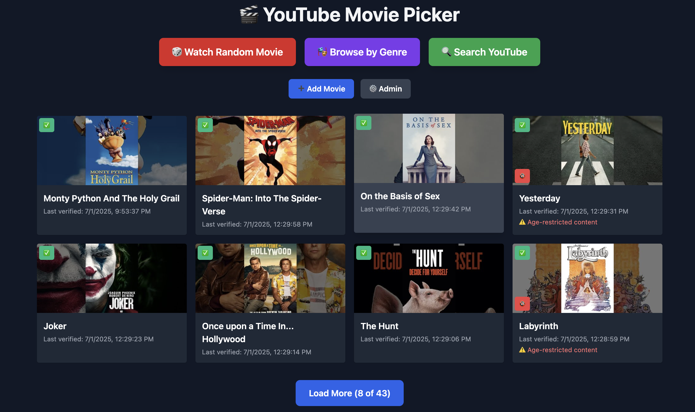
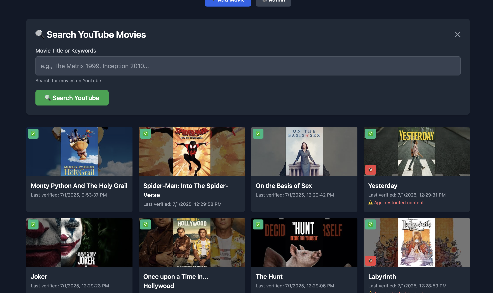
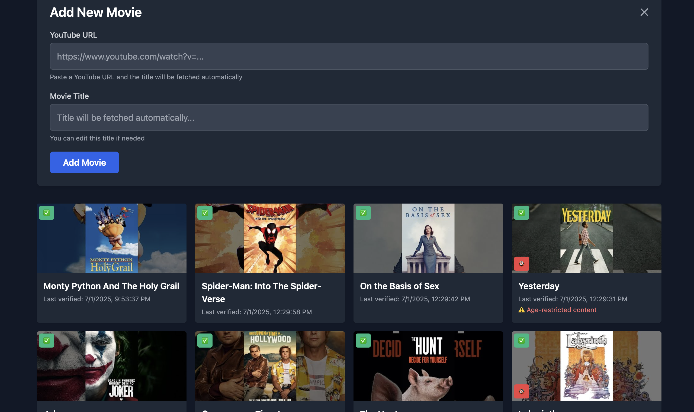
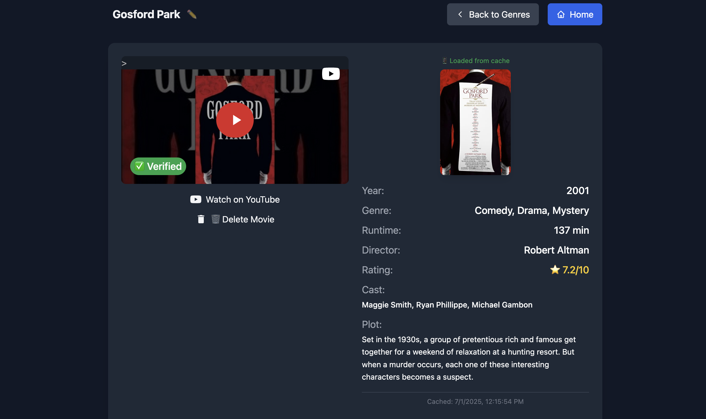
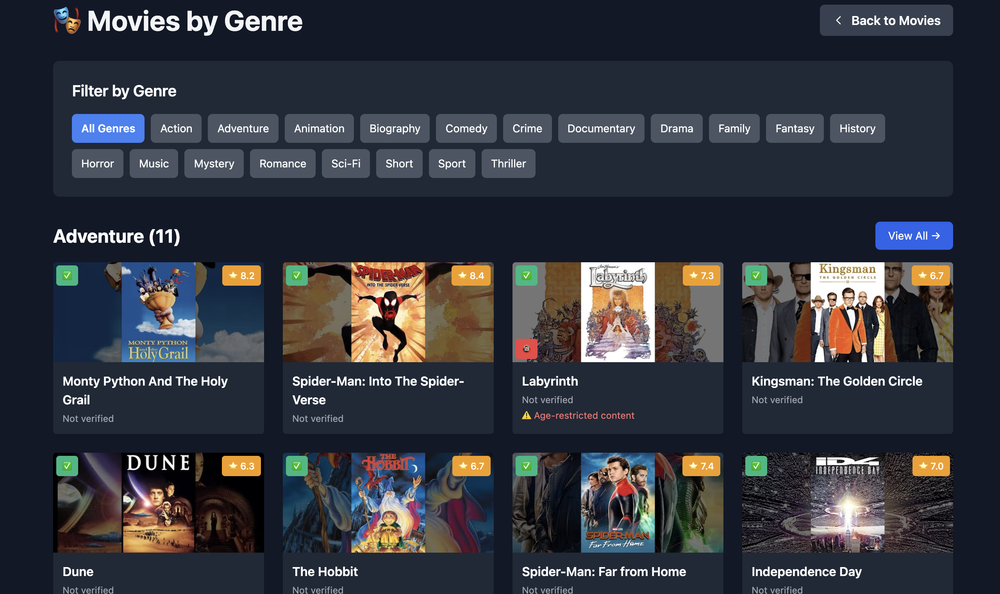
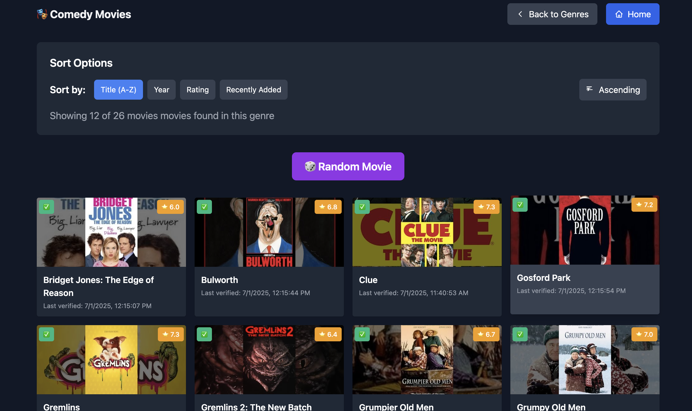
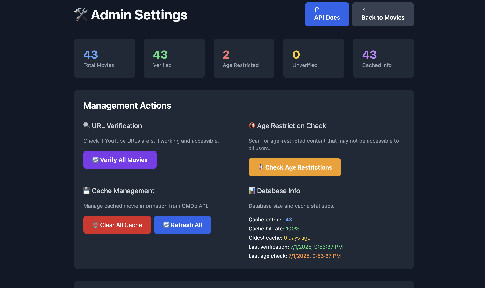

# 🎬 YouTube Movie Picker

_This project is not maintained. There is no roadmap. There is no support. There is only vibe coding._

## What is this?

Paste YouTube movie links. Filter by genre. Click random. Sometimes it works. Sometimes it doesn't. If it breaks, open an issue and I'll vibe code a fix. No promises. No explanations. No PRs.

## Screenshots

### Main Interface

*Main movie grid with genre filtering and random picker*

### Movie Search & Adding

*Search functionality for finding movies*


*Simple URL-based movie addition interface*

### Movie Details

*Rich movie information with OMDb metadata and verification status*

### Genre Management

*Browse movies by genre categories*


*Detailed view of movies within a specific genre*

### Admin Dashboard

*Statistics and management interface for administrators*

> 📸 **Note**: Screenshots show the app in action. Some features may look different due to ongoing vibe coding updates.

## How do I use it?

```sh
python3 -m venv venv
source venv/bin/activate
pip install -r requirements.txt
python app.py
```

Or use Docker. Or don't. Up to you.

## API

See [`API.md`](API.md). If you want a new endpoint, open an issue. I'll vibe code it. No docs, just code.

## Contributing

**No pull requests.**

If you want something, open an issue. I will respond with code only. No explanations. No reviews. No merges. Just pure, unfiltered vibe coding until it works (or doesn't).


## Features

- [x] **User Authentication**: Multi-user support with secure login/registration
- [x] **Personal Movie Lists**: Each user maintains their own movie collection
- [x] Add movies by YouTube URL or search
- [x] Genre filtering and detail pages
- [x] OMDb metadata (year, rating, poster, etc)
- [x] Age restriction and verification
- [x] Admin dashboard for stats and cache management
- [x] **Profile Management**: Edit profile, change password, view account info
- [x] Responsive, clean UI (mobile-friendly)
- [x] Random movie picker
- [x] API endpoints for everything
- [x] Verified badge overlays
- [x] Color-coded action buttons
- [x] Docker support

## Roadmap

There is no roadmap. Sometimes I add things if the vibes are right. Sometimes I don't. Features may appear, disappear, or never happen at all. If you want something, open an issue and maybe the vibes will deliver.

## License

MIT. Use it, break it, vibe with it. That's it.

### Manual Installation

See [INSTALL.md](INSTALL.md) for detailed installation instructions.

## 📖 Usage

### Getting Started
1. **First Time Setup**: Run the app and visit `/register` to create your user account
2. **Login**: Access the app at `/login` with your credentials
3. **Default Admin**: An admin user is created automatically (username: `admin`, password: `admin123` - change this immediately!)

### User Authentication
- **Registration**: Create a new account with username, email, and password
- **Login/Logout**: Secure session management with Flask-Login
- **Profile Management**: Edit your profile information and change password
- **Multi-User Support**: Each user has their own private movie collection

### Adding Movies
1. Click the "➕ Add Movie" button on the main page
2. Paste a YouTube URL - the title will be fetched automatically
3. Edit the title if needed and click "Add Movie"
4. The app will automatically verify the URL and fetch movie information

### Discovering Movies
- **Random Movie**: Click "🎲 Watch Random Movie" for instant discovery
- **Browse by Genre**: Click "🎭 Browse by Genre" to explore categorized movies
- **Movie Grid**: Scroll through all movies on the main page

### Movie Information
Each movie displays:
- ✅ Verification status (green checkmark if URL works)
- 🔞 Age restriction warnings
- 📅 Last verification date
- 🎬 Rich metadata (when available): plot, cast, director, IMDb rating

### Administration
Access the admin panel at `/admin` to:
- View your personal movie statistics and analytics
- Verify all your movie URLs
- Check for age-restricted content in your collection
- Manage cached movie information
- Monitor your account activity

> **Note**: Each user only sees their own movies and statistics. Admin users have additional system-wide privileges.

## 🔧 Configuration

### Environment Variables

| Variable | Default | Description |
|----------|---------|-------------|
| `HOST` | `0.0.0.0` | Server bind address |
| `PORT` | `5000` | Server port |
| `FLASK_DEBUG` | `False` | Enable debug mode |
| `FLASK_SECRET_KEY` | Auto-generated | Secret key for session management and CSRF protection |
| `OMDB_API_KEY` | None | OMDb API key for movie metadata |

### Getting OMDb API Key (Optional)

1. Visit [OMDb API](http://www.omdbapi.com/)
2. Sign up for a free API key
3. Add to your `.env` file: `OMDB_API_KEY=your_key_here`

Without an API key, the app still works but with limited movie metadata.

## 🗂️ Project Structure

```
YTMoviePicker/
├── app.py                 # Main Flask application
├── auth.py               # User authentication and management
├── forms.py              # WTForms for user input validation
├── migrate_users.py      # Database migration for user system
├── init_db.py            # Database initialization
├── docker-compose.yml    # Docker Compose configuration
├── Dockerfile            # Docker container definition
├── requirements.txt      # Python dependencies
├── templates/            # HTML templates
│   ├── index.html        # Main movie grid page
│   ├── movie_detail.html # Individual movie page
│   ├── admin.html        # Admin dashboard
│   ├── genres.html       # Genre browsing page
│   └── auth/             # Authentication templates
│       ├── login.html    # User login page
│       ├── register.html # User registration page
│       ├── profile.html  # User profile page
│       ├── edit_profile.html # Profile editing
│       └── change_password.html # Password change
├── data/                 # Database storage
│   └── movies.db         # SQLite database (with users table)
└── docs/                 # Documentation
    ├── README.md         # This file
    ├── INSTALL.md        # Installation guide
    └── API.md            # API documentation
```

## 🛠️ Technology Stack

- **Backend**: Python 3.12, Flask, Flask-Login, Flask-WTF
- **Database**: SQLite with automatic migrations and user management
- **Authentication**: Secure password hashing with Werkzeug
- **Forms**: WTForms for input validation and CSRF protection
- **Frontend**: HTML5, TailwindCSS, Vanilla JavaScript
- **API Documentation**: Swagger/Flasgger
- **Containerization**: Docker & Docker Compose
- **External APIs**: YouTube, OMDb API

## 🤝 Contributing

1. Fork the repository
2. Create a feature branch: `git checkout -b feature-name`
3. Make your changes and test thoroughly
4. Commit with clear messages: `git commit -m "Add feature description"`
5. Push to your fork: `git push origin feature-name`
6. Create a Pull Request

## 📝 License

This project is licensed under the MIT License - see the [LICENSE](LICENSE) file for details.

## 🆘 Support

- **Issues**: Report bugs and request features via [GitHub Issues](https://github.com/your-username/YTMoviePicker/issues)
- **API Documentation**: Available at `/api/docs/` when running the application
- **Installation Help**: See [INSTALL.md](INSTALL.md) for detailed setup instructions

## 🎯 Roadmap

- [x] ~~User authentication and personal movie lists~~ ✅ **COMPLETED**
- [ ] Movie ratings and reviews
- [ ] Advanced search and filtering
- [ ] Movie recommendations
- [ ] Export/import functionality
- [ ] Multiple database backends
- [ ] Mobile app companion
- [ ] Social features (sharing movie lists)
- [ ] Movie watch history and tracking

---

Made with ❤️ for movie enthusiasts everywhere!
